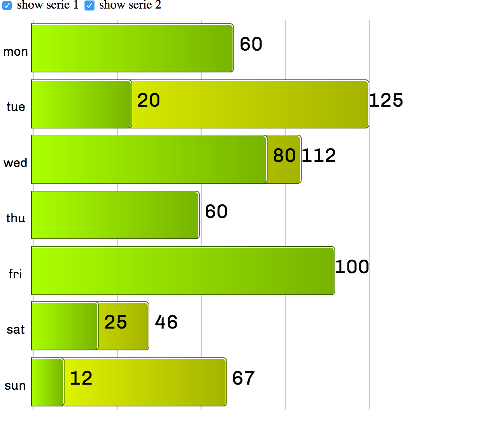
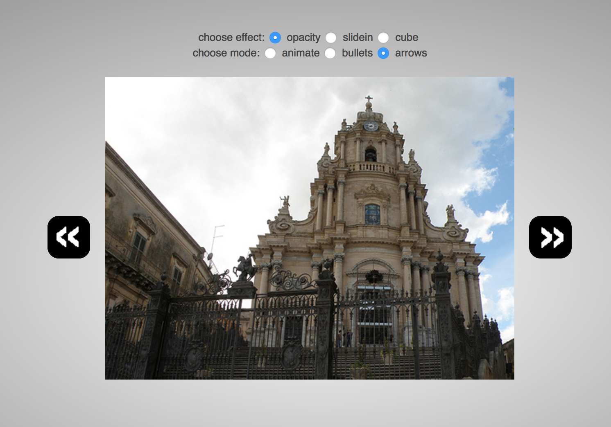
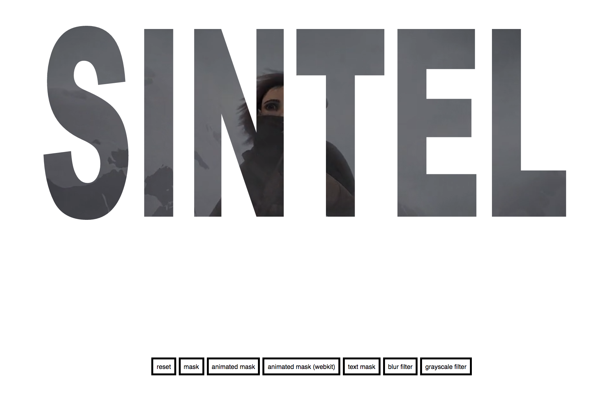

#Multiple CSS3 effects

This is a series of exercise from the book 'Designing Next Generation Web Projects with CSS3' (https://www.packtpub.com/web-development/designing-next-generation-web-projects-css3)

There are multiple components, like signup form, barchart, dynamic gallery, parallax, video mask, etc. All are implement by pure css3.

###sing up form

[Click me](https://manyang.github.io/web-project-with-css3/signup.html)

###bar chart

[Click me](https://manyang.github.io/web-project-with-css3/barchart/barchart.html)

##dynamic gallery

[Click me](https://manyang.github.io/web-project-with-css3/image-gallery.html)

###parallax

[Click me](https://manyang.github.io/web-project-with-css3/parallax.html)

###video mask

[Click me](https://manyang.github.io/web-project-with-css3/mask-video.html)
